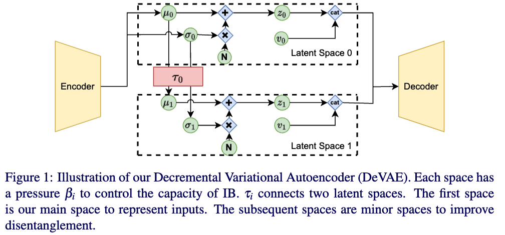

# disentanglement_lib-PyTorch Yes!


This project migrates google's [disentanglement_lib](https://github.com/google-research/disentanglement_lib) from tensorflow to PyTorch and provides new features. [See Example in Colab](https://colab.research.google.com/drive/1qqUl1kLtKCaDiJePyCkil0Vgy0KNaP9o?usp=sharing)

# Install
To install this library, run command:

``pip install git+https://github.com/erow/disentanglement_lib``


# useful programs

## dlib_run

`dlib_run` is a runnable program to train kinds of models flexiblely.
For example, the following command can train a vae with $beta=6$ on scream dsprites:
`dlib_run --model.regularizers="[@vae()]" --vae=6 -c disentanglement_lib/config/data/scream.gin --wandb` 

This project applies [gin](https://github.com/google/gin-config) to configure hyper-parameters globally. You can define parameters in file `-c *.gin` or pass parameters through pairs in arguments `--key=value`:
`dlib_run -c file.gin --key value` 

There are several pre-defined settings in **disentanglement_lib/config**.
For example, 
```bash
# define a model in model.gin
dlib_run --configs disentanglement_lib/config/data/imagenet100.gin model.gin --max_steps=200000 

# define a model in arguments
dlib_run --configs disentanglement_lib/config/data/dsprites.gin  --max_steps=300000 --model.regularizers="[@exp_annealing()]" 
```

Log and visualization with [wandb](https://wandb.ai/)

### Model

This project supports popular VAE variants, and these models can be specified by `--model.regularizers`.
The avaliable regularizaers are:
- vae
- annealed_vae
- factor_vae
- dip_vae
- beta_tc_vae
- cascade_vae_c
- exp_annealing
- deft
- control_vae
- dynamic_vae
- devae

### DeVAE

DeVAE utilizes hierarchical latent spaces to share disentanglement properties among spaces while promoting reconstruction on the first space.

```bash
python examples/devae.py -c disentanglement_lib/config/data/dsprites.gin --devae.betas=[1,40] --max_steps=300000 --wandb
```
You can find results of DeVAE in [report](https://wandb.ai/dlib/Public/reports/dlib--Vmlldzo0OTEwMzMw).

## dlib_download_data

Download data.
``dlib_download_data``

### Avaliable Dataset
Call `disentanglement_lib.data.named_data.get_named_ground_truth_data(name)`.
The avaliable datasets in `dataset.name` are:
- "dsprites_full"
- "dsprites_noshape"
- "dsprites_tiny"
- "dsprites_test"
- "color_dsprites"
- "noisy_dsprites"
- "scream_dsprites"
- "smallnorb"
- "cars3d"
- "mpi3d_toy"
- "mpi3d_realistic"
- "mpi3d_real"
- "shapes3d"
- "dummy_data"
- "translation"
- "chairs"
- "ffcv:{path}"

## dlib_visualize_dataset

`` dlib_visualize_dataset --name=shapes3d --path=outputs/shapes3d``


# Monitor 

It's convenient to use `disentanglement_lib.methods.unsupervised.callbacks` to track the intermediateness status of the model. Supported callbacks:
1. Decomposition: 
2. Traversal
3. ShowSamples
4. ComputeMetric


